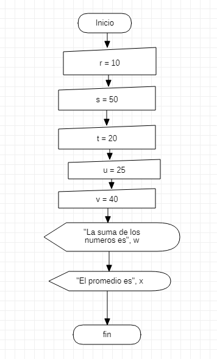

# **PROGRAMACION**


## **FECHA** <br>

### **septiembre 09 2021** <br>

en la clase se utilizaron los programas de excel visual basic 
y StarUML para seguir al fondo de la programacion cada vez mas 
esta vez se utilizo la combinacion de "MsgBox" y el "InputBox" 
recordamos que el comando "MsgBox" es para mostrar en execel lo 
que colocamos en visual basic y con el comando "InputBox" si 
queremos decirle o pedirle al usuario que digite informacion 
<br>

**EJEMPLO DE EXECEL VISAUL BASIC**
```
Sub ejemplo () 
    a = InputBox("digite primer numero")
    b = InputBox("digite segundo numero")
    c = a + b 
    MsgBox "la suma es " & c
End Sub
```
**EJERCICIO DE EXECEL VISUAL BASIC** 

```
Sub promedio()
    r = InputBox("digita primer número")
    s = InputBox("digita segundo número")
    t = InputBox("digita tercer número")
    u = InputBox("digita cuarto número")
    v = InputBox("digita quinto número")
    w = Int(r) + Int(s) + Int(t) + Int(u) + Int(v)
    x = w / 5
    MsgBox "El promedio es" & x
End Sub
```
**DIAGRAMA DE FLUJO DE STAR UML**

