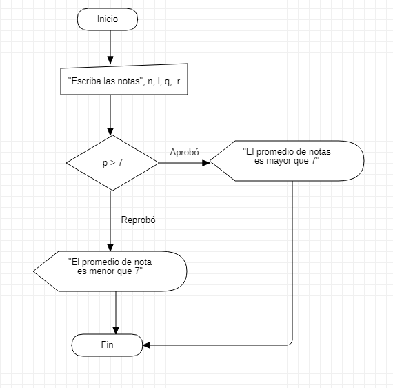

# **PROGRAMACION** 


## **FECHA** <br>

### **septiembre 13 2021** <br>

en esta clase aprendimos en visual basic a 
hacer que el programa tenga una serie de 
opciones para eso utilizamos en visual basic 
el codigo " Int(InputBox("texto")) "  <br>

**EJEMPLO DE EXECEL VISUAL BASIC** <br>
```
Sub ejemplo ()
    
    n = Int(InputBox("ingrese el primer 
    numero"))
    
    If (n > 10) Then
        MsgBox" n es mayor " & n & " o igual 
        que 10 "
    
    Else
        MsfBox" n es menor " & n & " que 
        10 "
    End If    
End Sub
```
**EJERCICIO DE EXECEL VISUAL BASIC** <br>

```
Sub inicio()
    n = Int(InputBox("escriba primera nota"))
    l = Int(InputBox("escriba segunda nota"))
    q = Int(InputBox("escriba tercera nota"))
    r = Int(InputBox("escriba cuarta nota"))
    s = n + l + q + r
    p = s / 4
    If (p > 7) Then
        MsgBox "con la nota" & p & " el estudiante aprobo "
    Else
        MsgBox "con la nota" & p & " el estudiante reprobo "
    End If
End Sub
```
**DIAGRAMA DE FLUJO DE STAR UML** <br>

