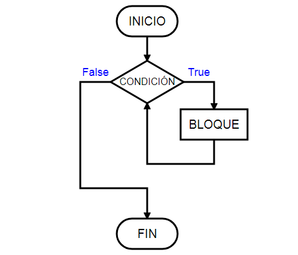

# Clase de diciembre 2021

## Ciclos

### While

Un bucle while permite repetir la ejecución de un grupo de instrucciones mientras se cumpla una condición (es decir, mientras la condición tenga el valor True).

### Diagrama de flujo

### Ejercicio

Realizar un ciclo while en VBA que sume los numeros de la columna A y que la celda (1,1) empiece con el 0, y con la condicion de que cuando el usuario coloque 0 se termine el ciclo.

Sub ciclo()

    Hoja1.Cells(1, 1) = 0
    s = 2
    p = 1
    While p <> 0

        p = InputBox("numero")
        Hoja1.Cells(s, 1) = p
        Hoja1.Cells(1, 1) = Hoja1.Cells(s, 1) + Hoja1.Cells(1, 1)
        s = s + 1

    Wend
    
End Sub